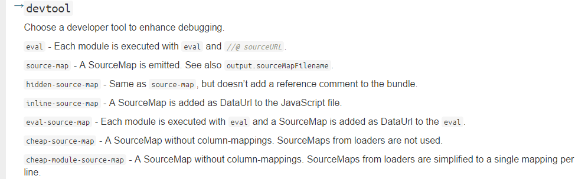

# webpack高级配置

* CommonChunks插件

顾名思义，Common Chunks 插件的作用就是提取代码中的公共模块，然后将公共模块打包到一个独立的文件中去，以便在其它的入口和模块中使用

配置方法:

``` js
/**
common.js 公共模块的文件名
['main1','main2'] 这个数组与entry保持一一对应关系，表示要提取这些模块中的公共代码
*/
    plugins:[
        new  webpack.optimize.CommonsChunkPlugin('common.js', ['main1', 'main2'])
    ]
```

参考[https://webpack.github.io/docs/list-of-plugins.html](https://webpack.github.io/docs/list-of-plugins.html)

* SourceMap


常用配置方法：

``` js

devtool: 'eval-source-map'
//或者：devtool: 'source-map',

```
参考[https://webpack.github.io/docs/configuration.html#devtool](https://webpack.github.io/docs/configuration.html#devtool)

