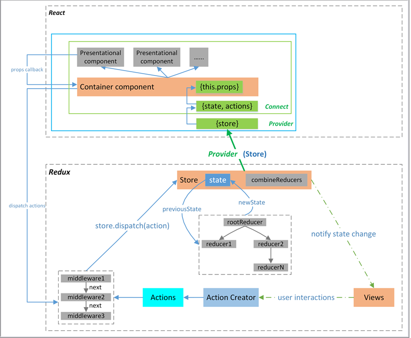

# 了解react-redux

该库为redux官方提供的react绑定库，具有高效且灵活的特性

react-redux 提出了容器组件(Container Component)和展示组件(Presentational Component)的概念

<table class='table table-bordered'>
    <thead>
        <tr>
            <th></th>
            <th style="text-align:left">容器组件</th>
            <th style="text-align:left">展示组件</th>
        </tr>
    </thead>
    <tbody>
        <tr>
          <th style="text-align:right">Location</th>
          <td>最顶层，路由处理</td>
          <td>中间和子组件</td>
        </tr>
        <tr>
          <th style="text-align:right">Aware of Redux</th>
          <td>是</td>
          <td>否</td></tr>
        <tr>
          <th style="text-align:right">读取数据</th>
          <td>从 Redux 获取 state</td>
          <td>从 props 获取数据</td>
        </tr>
        <tr>
          <th style="text-align:right">修改数据</th>
          <td>向 Redux 派发 actions</td>
          <td>从 props 调用回调函数</td>
        </tr>
    </tbody>
</table>
