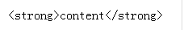
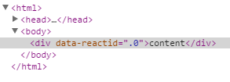
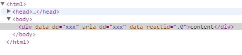

## JSX使用注意点


	JSX：JavaScript Xml 

- ### 限定规则

render 方法返回的组件必须是有且只有一个根组件，错误情况的例子

``` javascript
  // 无法编译通过，JSX 会提示编译错误
  function render() {
    return (<p> .... </p>
           <p> .... </p>)
  }
```

- ### 组件命名

	小写的字符串是HTML标签，大写开头的变量是React组件

	小写,使用HTML标签：

``` javascript

	import React from 'react';
	import { render } from 'react-dom';

	var myDivElement = <div className="foo" />;
	render(myDivElement, document.getElementById('mountNode'));

```

	大写，使用React组件
``` javascript
	import React from 'react';
	import { render } from 'react-dom';
	import MyComponent from './MyComponet';

	var myElement = <MyComponent someProperty={true} />;
	render(myElement, document.body);

```

- ### 标签属性

	JS的保留字

	class---->className

	for------>htmlFor

	事件 采用驼峰式命名法

	onchange------>onChange

	onclick------>onClick

- ### 行内样式
	
	style属性

	在React中写行内样式时，要这样写，不能采用引号的方式写

``` javascript
	React.render(
	    <div style={{color:'red',backgroundColor:'#fff',height:100,width:100}}>
	        xxxxx
	    </div>,
	    document.body
	);
```
另外：
1 简化了宽度和高度的写法，不需要写单位，100->100px

2 属性值驼峰式 

如果需要添加浏览器前缀 -webkit-、-ms- 使用大驼峰(除了-ms-),如：

``` javascript

var divStyle = {
  WebkitTransition: 'all', // 'W' 是大写
  msTransition: 'all'      // 'ms' 为小写
};

```


- ### HTML转义

比如我们有一些内容是用户输入的富文本，从后台取到数据后展示在页面上，希望展示相应的样式

``` javascript
	var content='<strong>content</strong>';

	React.render(
	    <div>{content}</div>,
	    document.body
	);
```
结果页面直接输出内容了：



React默认会进行HTML的转义，避免XSS攻击，如果要不转义，可以这么写

``` javascipt
	var content='<strong>content</strong>';    

	React.render(
	    <div dangerouslySetInnerHTML={{__html: content}}></div>,
	    document.body
	);
```
页面效果


- ### 自定义HTML属性

如果在编写React过程中使用了自定义属性，React不会渲染的
``` javascipt
	React.render(
	    <div dd='xxx'>content</div>,
	    document.body
	);
```


要使用data-xx aria-xx结合使用
``` javascript
	React.render(
	    <div data-dd='xxx' aria-dd='xxx'>content</div>,
	    document.body
	);
```


- ### 注释
同javascript注释一样
	- 单行注释 //comments

	- 多行注释 /* comments */

<span style="color:red">Tips</span>

在render()方法体内return返回DOM结构时的注释需要用花括号{}
``` javascript
 render() {
        return (<div>
            {
               // <span>视频流量
            } 
            <strong className="number videoAll">{this.state['L4_DW_THROUGHPUT']}GB</strong>
            </span>
               <span>高清视频流量
            <strong className="number videoHd">{this.state['VIDEO_RATE_HIGH_THROUGHPUT']}GB</strong>
            </span>
               <span>视频业务次数
            <strong className="number videoTimes">{this.state['INTBUFFER_SR_TOTAL']}次</strong>
            </span>
        </div>)
    }
```

- ### JS表达式

表达式

表达式用{}包起来，不要加引号，加引号就会被当成字符串。

JSX是HTML和JavaScript混写的语法，当遇到<，JSX就当HTML解析，遇到{就当JavaScript解析

``` javascript
    render(){
        return(
            <span className="time number" ref="spanTime">{this.state.time}</span>
        )
    }
```
- ### 属性表达式

``` javascript
	ReactDOM.render(
	    <div className={2 > 1 ? 'class-a' : 'class-b'}>content</div>,
	    document.body
	);
```

- ### 子表达式

``` javascript
	var Nav = React.createClass({
	    render: function () {
	        return <div>nav</div>
	    }
	});

	ReactDOM.render(
	    <div>
	        {2 > 1 ? <Nav/> : <div>div</div>}
	    </div>,
	    document.body
	);
```
- ### JSX延伸属性
	- 不要改变props

	 如果提前就知道了组件的属性的话，写起来很容易。例如component组件有两个动态的属性foo和bar：
``` javascript
	var component = <Component foo={x} bar={y} />;

```
		而实际上，有些属性可能是后续添加的，我们没办法一开始就确定，我们可能会写出下面不好的代码：

``` javascript
	var component = <Component />;
	component.props.foo = x; // bad
	component.props.bar = y; // also bad
```

		这样写是错误的，因为我们手动直接添加的属性React后续没办法检查到属性类型错误，也就是说，当我们手动添加
		的属性发生类型错误时，在控制台是看不到错误信息的。

		在React的设定中，初始化完props后，props是不可变的。改变props会引起无法想象的后果。

- 延伸属性

	为了解决这个问题，React引入了属性延伸
``` javascipt
	var props = {};
	props.foo = x;
	props.bar = y;
	var component = <Component {...props} />;
```
	当需要拓展我们的属性的时候，定义个一个属性对象，并通过{...props}的方式引入，React会帮我们拷贝到组件的props属性中。重要的是
	这个过程是由React操控的，不是手动添赋值的属性。

	需要覆盖的时候可以这样写：

``` javascript
	var props = { foo: 'default' };
	var component = <Component {...props} foo={'override'} />;
```
