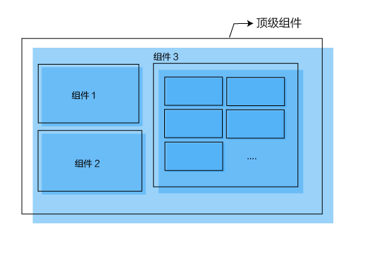
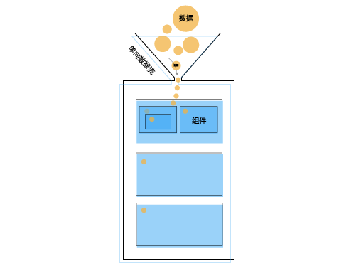

# 为什么选择React？

### 前端开发我们需要考虑哪些问题？

1 组件化和模块化

2 开发效率

3 运行效率

4 可维护性

5 体验优化

### 目前解决这些问题的技术方案

- 组件化和模块化

[jQuery-plugin](http://plugins.jquery.com/)、[React](https://facebook.github.io/react/)、[angular-directive](https://docs.angularjs.org/guide/directive)、[webComponent](http://webcomponents.org/)、[polymer](http://www.polymer-project.org/)、[x-tag](http://x-tag.github.io/)

- 开发效率

MVC([Backbone](http://backbonejs.org/)) < Flux([React](https://facebook.github.io/react/)) < MVVM([Angular.js](https://angularjs.org/)、[Vue](https://vuejs.org.cn/)、[ember.js](http://emberjs.com/))

- 运行效率

[Backbone](http://backbonejs.org/)、[React](https://facebook.github.io/react/)

- 可维护性

[Flux](https://facebook.github.io/flux/)、[Redux](http://cn.redux.js.org/)

- 体验优化

SPA、WebAPP

### React技术栈对上述问题的解决

- 组件化和模块化

React 天生组件化，这是 React 的核心，除了能够在团队内部积累业务组件以外，也能找到众多开源组件的实现 

- 模块化

基于 webpack 可以使用 Es6 或 CommonJs 的写法实现模块化代码 

- 开发效率

React 的代码基本就是组件的组合，分而治之的方式让代码的可阅读性很高，容易理解。 而且相比于 MVC 几乎是去除了 Controller 的角色，只用关心一个 render 函数，不用关系视图局部的修改。

- 运行效率

React 实现了 Virtual DOM ，相比于 MVVM 框架具有更优的效率 

- 可维护性

React 基于 flux 或 redux 的架构设计，确定性的 store 很容易定位问题，无论是新增业务代码还是查找业务 bug 都不再是难题

- 体验优化

基于 React 可以很容易的实现 SPA （React-router）

### [React的独特之处](https://segmentfault.com/a/1190000005140569)

- 组件的组合模式

- 单向数据流的设计

- 高效的性能

VirtualDOM

- 分离的设计

react.js react-dom.js