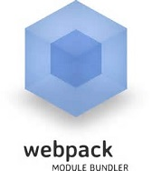

## 为什么需要打包？
- #### 模块化

		前端代码越来越复杂，不能将所有的代码都写在同一个js文件中，这样不便于阅读和维护，所以前端模块化
		应运而生，那么怎么将这些分散的模块进行组合呢？这个工作就是目前前端工程化工具为我们做的。

	常用的工具有：

	
[npm](https://www.npmjs.com/)

	
[bower](https://bower.io/)

	
[grunt](http://gruntjs.com/)

	
[gulp](http://gulpjs.com/)

	
[browerify](http://browserify.org/)

	
[webpack](https://webpack.github.io/)

[yeoman](http://yeoman.io/)

......

- #### 优化加载速度

	将整个项目中所有的JS、CSS、HTML、图片进行压缩合并处理

- #### 使用新的开发模式

	比如在React开发过程中会使用到JSX和ES6语法，需要我们在上线之前就要进行解析，手动解析是很耗时、耗力且不能很好控制模块依赖关系