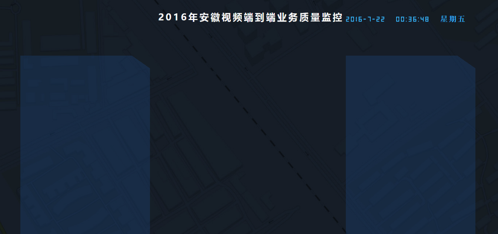

## 一步一步使用Webpack构建React项目
下面以《安徽大屏》项目为实例讲解
[示例源码下载](http://pan.baidu.com/s/1mh7S9yK)
### 建立项目
在任意目录下建立项目文件夹，这里就以[Anhui-React]() 为项目名称

初始化项目，生成package.json
```bash
$ npm init -y
```
新建webpack.config.js文件
整个项目的目录结构如下：

* /app
	- components
	- config
	- css
	- font
	- images
	- utils
	+ index.jsx
* /build
	+ index.html
	+ boundle.js
+ .babelrc
+ package.json
+ webpack.config.js

app目录下存放的是在开发过程中的代码文件，component 文件夹存放的React组件，config文件夹存放项目中的一些配置文件，css存放样式文件，font存放字体文件，images存放图片文件，utils文件夹存放一些通用的方法，index,jsx作为项目的主入口文件

build文件夹存放项目使用阶段的文件，index.html项目的主页，boundle.js工程文件打包处理后的文件

.babelrc babel编译配置文件
package.json 项目描述和包依赖配置管理文件
webpack.config.js webpack 任务处理配置文件

package.json 文件

```json
{
  "name": "Anhui-React",
  "version": "1.0.0",
  "description": "",
  "main": "index.js",
  "scripts": {
    "start": "webpack-dev-server --watch",
    "test": "echo \"Error: no test specified\" && exit 1"
  },
  "author": "phobo",
  "license": "ISC",
  "dependencies": {
    "react": "^15.2.1",
    "react-dom": "^15.2.1"
  },
  "devDependencies": {
    "babel-core": "^6.11.4",
    "babel-loader": "^6.2.4",
    "babel-plugin-react-transform": "^2.0.2",
    "babel-preset-es2015": "^6.9.0",
    "babel-preset-react": "^6.11.1",
    "babel-preset-react-hmre": "^1.1.1",
    "css-loader": "^0.23.1",
    "echarts": "^3.2.2",
    "element-resize-event": "^2.0.5",
    "file-loader": "^0.9.0",
    "style-loader": "^0.13.1",
    "url-loader": "^0.5.7",
    "webpack": "^1.13.1",
    "webpack-dev-server": "^1.14.1"
  }
}

```
使用命令行
```bash
$ npm install
```
文件说明：

项目必须依赖的包放在dependencies下面

```bash
 $ npm install /your modules name/ --save
```

 在开发过程中需要依赖的包放在devDependencies下面

```bash
 $ npm install /your modules name/ --save-dev
```
.babelrc

``` javascript
{
  "presets": ["react", "es2015"],
  "env": {
   "development": {
   }
  }
}

```
说明：
presets 中配置的就是在指示babel要需要编译的语法类型

webpack.config.js
``` javascript
var path = require('path');
var ROOT_PATH = path.resolve(__dirname);
var APP_PATH = path.resolve(ROOT_PATH, 'app');
var BUILD_PATH = path.resolve(ROOT_PATH, 'build');

module.exports= {
  entry: {
    app: path.resolve(APP_PATH, 'index.jsx')
  },
  output: {
    path: BUILD_PATH,
    filename: 'bundle.js'
  },
  resolve: {
      extensions: ['', '.js', '.jsx']
  },
  module: {
    loaders: [
      {
        test: /\.jsx?$/,
        loaders: ['babel'],
        include: APP_PATH
      },
      {
        test: /\.css$/,
        loader: 'style!css',
        include:APP_PATH
      },
      {
        test: /\.(png|jpg|TTF)$/,
        loader: 'url?limit=40000'
      }
    ]
  }
}

```
说明：最开始的一堆var配置的是一些有关路径的变量
entry:程序的主入口
output:打包处理后存放的文件
resolve：在代码中使用require（）或者import时可以不用跟这里配置的后缀名，比如：

``` javascript

import react from 'react';

```
module:所有需要使用插件的地方都在loaders这里面配置

	test:一般为一个正则表达式，限定需要编译转换的文件

	loaders:对上面匹配到的文件进行处理的插件

	include：指定匹配的文件路径

build文件夹下面的index.html代码如下：
``` html
<!DOCTYPE html>
<html>
  <head>
    <meta charset="UTF-8">
    <title>Anhui-React</title>
  </head>
  <body>
  <div class="contai">
    <!--头部-->
    <div class="header">
      <!--时间-->
      <div class="title" id="title"></div>
      <!--流量统计-->
      <div class="overview" id="overview"></div>
    </div>
    <div class="main">
      <!--左侧统计表-->
      <div class="slice">
        <div class="box" id="box-left"></div>
      </div>
      <div class="center">
        <!--地图-->
        <div class="map">
          <div id="map"></div>
        </div>
      </div>
      <!--右侧统计表-->
      <div class="slice">
        <div class="box"></div>
      </div>
    </div>
  </div>
  <script type="text/javascript" src="bundle.js"></script>
  </body>
</html>

```

注意：整个html文件中只引入了一个js文件

接下来在components文件夹下面创建一个名为HeadComponents.jsx的文件，代码如下：

``` javascript

import React from 'react';
import ReactDOM from 'react-dom';
import  {formatDate} from '../utils/time-transfer';
import TimerComponent from "./TimerComponent.jsx"

var year=new Date().getFullYear();
var time=formatDate(new Date(),"yyyy-MM-dd   hh:ii:ss  week");

export  default class HeadComponent extends React.Component {
    constructor(props){
        super();
        this.state={
            year:year
        }
    }
    componentDidMount(){
        var me=this;
        var timer= setInterval(function(){
            time+=1000;
            var date=new Date();
            //查找DOM
            ReactDOM.findDOMNode(me.refs.spanYear).innerHTML=date.getFullYear();
        },1000)
    }
    render() {
        return (
            <div>
                <span className="year testName" ref="spanYear">{this.state.year}</span>
                <span>年安徽视频端到端业务质量监控</span>
                <TimerComponent time={time}/>
            </div>
        )
    }
}

```
还是在这个目录下创建一个名为TimerComponent.jsx文件，代码如下：
``` javascript
import React from 'react';
import ReactDOM from 'react-dom';
import  {formatDate} from '../utils/time-transfer';
var time=formatDate(new Date(),"yyyy-MM-dd   hh:ii:ss  week");

export default class TimerComponent extends React.Component{
    constructor(props){
        super();
        this.state={
            time:time
        }
    }
    render(){
        return(
            <span className="time number" ref="spanTime">{this.state.time}</span>
        )
    }
    //在初始化渲染执行之后立刻调用一次
    componentDidMount(){
        var me=this;
        var timer= setInterval(function(){
            time+=1000;
            var date=new Date();
            var timeText=formatDate(date,"yyyy-MM-dd   hh:ii:ss  week");
            //查找DOM
            ReactDOM.findDOMNode(me.refs.spanTime).innerHTML=timeText;
        },1000)
    }
}

```
在utils文件夹下创建2个js文件

ajax.js 处理异步请求的公共方法

``` javascipt

export  function get(url) {
  return new Promise(function(resolve, reject) {
    const xhr = new XMLHttpRequest();
    xhr.open('GET', url);
    xhr.send(null);
    xhr.addEventListener('readystatechange', function() {
      if (xhr.readyState === 4 && xhr.status === 200) {
        try {
          const data = JSON.parse(xhr.responseText);
          resolve(data);
        } catch (e) {
          reject(e);
        }
      }
    });
    xhr.addEventListener('error', function(e) {
      reject(error);
    });
  });
};

```

time-transfer.js 日期转换公共方法

``` javascript
export function formatDate(date,str) {
    str= str.toLowerCase();
    var that=this;

    if(/yyyy/.test(str)){
        str=str.replace(/yyyy/,date.getFullYear());
    }
    if(/mm/.test(str)){
        str=str.replace(/mm/,date.getMonth()+1);
    }
    if(/dd/.test(str)){
        str=str.replace(/dd/,date.getDate());
    }
    if(/hh/.test(str)){
        str=str.replace(/hh/,function(){
            return date.getHours()>=10?date.getHours():("0"+date.getHours());
        });
    }
    if(/ii/.test(str)){
        str=str.replace( /ii/,function(){
            return date.getMinutes()>=10?date.getMinutes():("0"+date.getMinutes());
        });
    }
    if(/ss/.test(str)){
        str=str.replace( /ss/,function(){
            return date.getSeconds()>=10?date.getSeconds():("0"+date.getSeconds());
        });
    }
    if(/week/.test(str)){
        if(date.getDay()==0){
            str=str.replace(/week/,'星期日' );
        }
        if(date.getDay()==1){
            str=str.replace(/week/,'星期一' );
        }
        if(date.getDay()==2){
            str=str.replace(/week/,'星期二' );
        }
        if(date.getDay()==3){
            str=str.replace(/week/,'星期三' );
        }
        if(date.getDay()==4){
            str=str.replace(/week/,'星期四' );
        }
        if(date.getDay()==5){
            str=str.replace(/week/,'星期五' );
        }
        if(date.getDay()==6){
            str=str.replace(/week/,'星期六' );
        }
    }

    return str
}

```
入口文件index.jsx

``` javascript

import './css/base.css';
import React from 'react';
import ReactDOM from 'react-dom';
import HeadComponent from './components/HeadComponent.jsx';
import OverViewComponent from './components/OverViewComponent.jsx';
import MapComponent from './components/MapComponent.jsx';

ReactDOM.render(
    <HeadComponent></HeadComponent>,
    document.getElementById('title')
);

```

css文件这里就不贴了，太大了，可以去源码中找

哦啦。所有的代码弄好了，下面让我们在webpack.config.js同级目录下运行命令：

``` bash
$ webpack

```

然后将我们的项目放在任意服务器中，在地址栏中打开我们的首页



[示例源码下载](http://pan.baidu.com/s/1mh7S9yK)

