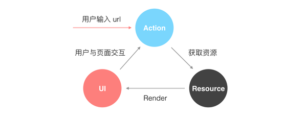
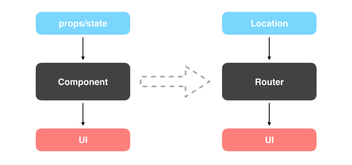

# react-router路由机制

* 为什么要使用路由？

* 原理

> 保证URL和视图同步

* react-router

参考[https://zhuanlan.zhihu.com/p/20381597](https://zhuanlan.zhihu.com/p/20381597)

* url "#"号

参考[http://www.ruanyifeng.com/blog/2011/03/url_hash.html](http://www.ruanyifeng.com/blog/2011/03/url_hash.html)
