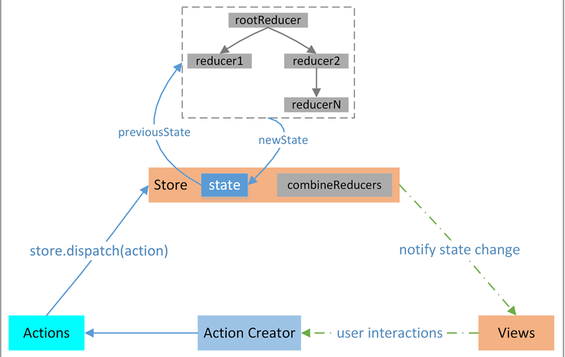

# 初识redux



### 三大基本原则

* 单一数据源

> 整个应用的 state 被储存在一棵 object tree 中，并且这个 object tree 只存在于唯一一个 store 中。


* State只读

> 惟一改变 state 的方法就是触发 action，action 是一个用于描述已发生事件的普通对象。

* 使用纯函数执行修改

> 为了描述 action 如何改变 state tree ，你需要编写 reducers。Reducer 只是一些[纯函数]()，它接收先前的 state 和 action，并返回新的 state

``` javascript

export function selectedUsersPage(state = 1, action) {
    switch (action.type) {
        case SELECT_USERS_PAGE:
            return action.page;
        default:
            return state;
    }
}

```
纯函数

> 纯函数是这样一种函数，即相同的输入，永远会得到相同的输出，而且没有任何可观察的副作用。

举例

比如 slice 和 splice，这两个函数的作用并无二致——但是注意，它们各自的方式却大不同，但不管怎么说作用还是一样的。我们说 slice 符合纯函数的定义是因为对相同的输入它保证能返回相同的输出。而 splice 却会嚼烂调用它的那个数组，然后再吐出来；这就会产生可观察到的副作用，即这个数组永久地改变了。

``` js
var xs = [1,2,3,4,5];

// 纯的
xs.slice(0,3);
//=> [1,2,3]

xs.slice(0,3);
//=> [1,2,3]

xs.slice(0,3);
//=> [1,2,3]


// 不纯的
xs.splice(0,3);
//=> [1,2,3]

xs.splice(0,3);
//=> [4,5]

xs.splice(0,3);
//=> []

```

参考 [http://cn.redux.js.org/docs/introduction/index.html](http://cn.redux.js.org/docs/introduction/index.html)

[https://github.com/WilberTian/StepByStep-Redux](https://github.com/WilberTian/StepByStep-Redux)